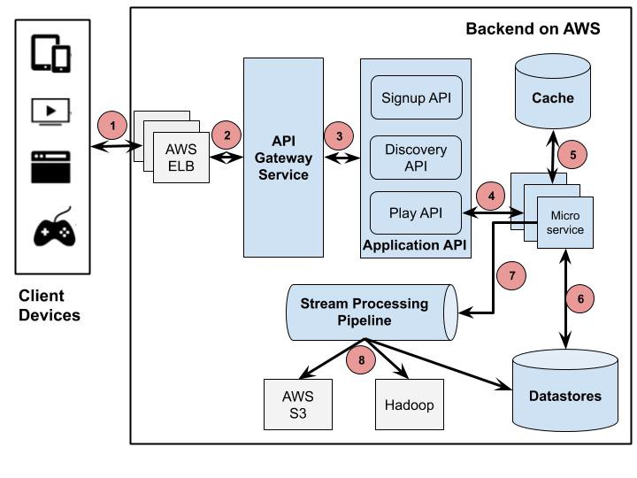

# Company_file_service
This repository will contain an infrastructure diagram describing bottlenecks of the whole service with estimated costs.

# Problem
- Provide an infrastructure diagram describing bottlenecks of the whole service with estimated costs for 1,000, 1,000,000, and 1,000,000,000 users with 10gb files -- %40 video -- and 1000 requests per user/day.

# Solution
*Note: Since I don't have clear information about the development of the application, I am assuming everything on my end. Also note that this is a general high-level overview on how this solution could be implemented, just for guidance.*

For this approach, since I don't a long track doing architecture for an environment like this, I will use an approach similar to what Netflix does for their video streaming application. They are the best in this field and I think it's a good idea to learn from them.

In order to release some of the infra administration, we will place everything in the cloud, being AWS the one we will use for this case but I think any major cloud provider will do.

### Diagram

1. The Client sends a Play request to Backend running on AWS. That request is handled by AWS Load balancer (ELB)

2. AWS ELB will forward that request to API Gateway Service running on AWS EC2 instances. 

3. Application API component is the core business logic behind the application operations.

4. Play API will call a microservice or a sequence of microservices to fulfill the request.

5. Microservices are mostly stateless small programs and can call each other as well.

6. Microservices can save to or get data from a data store during its process.

7. Microservices can send events for tracking user activities or other data to the Stream Processing Pipeline for either real-time processing of personalized recommendation or batch processing of business intelligence tasks.

8. The data coming out of the Stream Processing Pipeline can be persistent to other data stores such as AWS S3, Hadoop HDFS, Cassandra, etc.

### Estimated Cost

Since we are hosting everything in the cloud, using AWS S3, we will use their price calculator to get an estimation of the pricing for this service.

Users         | Monthly Price     |
------------- | ------------------|
1000          | 230 USD           |
1,000 000     | 210,575.60 USD    |
1,000,000,000 | 21,012,963.20 USD |

(https://calculator.aws/#/createCalculator)

# Problem
- How would you assure developer happiness for this service. Please send details about how local development environments are set, what are the rules for submitting code to
production?

*Note: First, I would like to clarify that I am not a developer, but I will tray to put on the table some of the things I have learned along the way in my career, hoping it can answer this question properly.*

# Solution

### Explaination
To keep out developers happy, I would implement a development environment based on Vagrant.

Vagrant generalizes virtual machine creation across multiple virtualization tools such as VirtualBox or VMware and even provides remote options for AWS, OpenStack or GCE. Vagrant configures and provisions virtual machines, based on configuration file called Vagrantfile. The syntax of this file is the Ruby programming language and as it is a simple text file we can easily commit it to our project VCS repository. 

Vagrant can easily be learned and integrated with Visual Studio Code and Docker.

(https://www.vagrantup.com)

### Diagram

1. The user creates a Vagrantfile, which is a declarative file (written in Ruby) that describes the type of machine needed, as well as how to configure and provision that machine. The user uses Vagrant to execute the Vagrantfile.

2. Vagrant uses VirtualBox as a provider. It can also use other providers.

3. The machine is up.

4. Vagrant invokes a provisioner to configure the machine.

5. The provisioner provisions the machine. It can be a simple shell script or Ansible, for example.

6. One can access the deployed machine by ssh.

### Rules

1. Ensure the compile/build process is always done automatically 

2. Build and Pack once

3. All the deployments have to be done exactly in the same way

4. Use feature flags in the application

5. Always deploy using smaller batches

6. The code has to be reviewed by a code checking tool, like Sonar for example

# Solution
*Note: I would need to have a bit of more input about the application hosting this service, in order to design the proper dev env so, let's say this is a containerized app and will setup an agile containers based development environment*

- Which best practices should be applied while working with a team of 20 developers?

- Describe how the CI/CD infrastructure should be for this kind of service.
